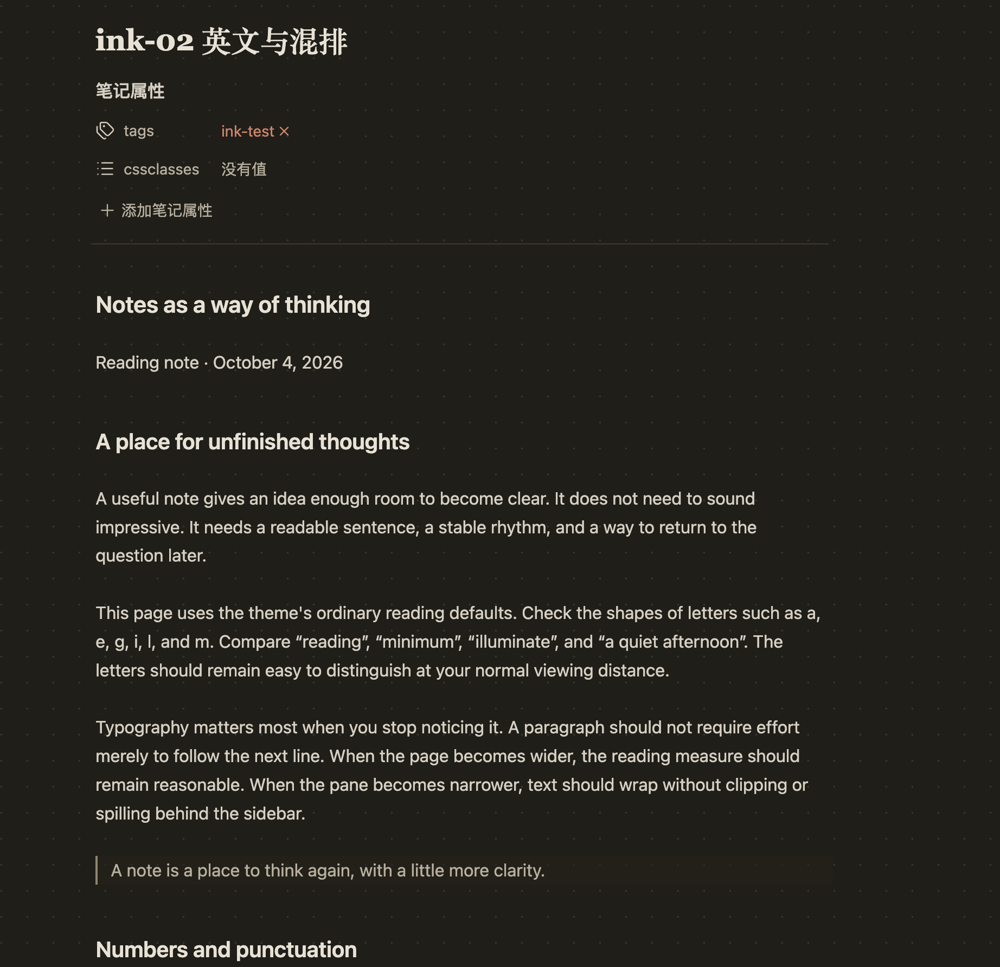
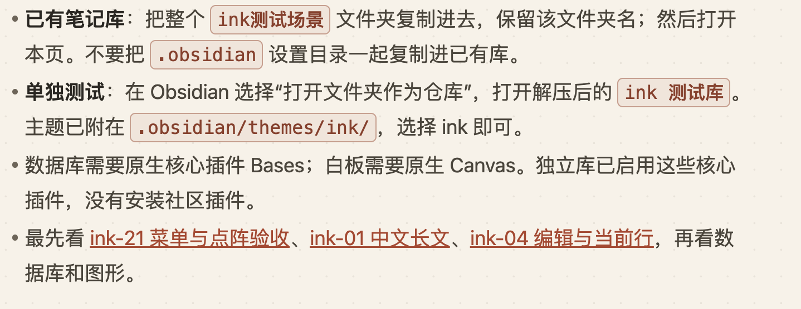

# ink

A warm paper-inspired Obsidian theme by [ThreeAndTwo](https://github.com/ThreeAndTwo). Quiet dotted backgrounds, readable system fonts, and distinct styles for the things that matter in a note.

[中文说明](README.zh-CN.md) · [MIT License](LICENSE) · [Changelog](CHANGELOG.md)

## Install ink

**[Download ink 0.0.1](https://github.com/ThreeAndTwo/obsidian-ink-theme/releases/download/0.0.1/ink-0.0.1.zip)** · [Release and individual files](https://github.com/ThreeAndTwo/obsidian-ink-theme/releases/tag/0.0.1) · [Installation help](docs/install.md)

Requires Obsidian **1.8.0 or later**. Newer diagram syntax and Bases depend on your Obsidian version.

1. Download `ink-0.0.1.zip` and extract it. The extracted `ink` folder contains `manifest.json` and `theme.css`.
2. Put that folder inside your vault's `.obsidian/themes/` directory. The final paths must be `.obsidian/themes/ink/manifest.json` and `.obsidian/themes/ink/theme.css`.
3. In Obsidian, open **Settings → Appearance → Themes**, select **ink**, and choose light or dark mode.
4. If replacing an older copy, reselect the theme or restart Obsidian.

No source checkout, build tools or community plugin is required to install the theme. The separate [example vault ZIP](https://github.com/ThreeAndTwo/obsidian-ink-theme/releases/download/0.0.1/ink-tests-0.0.1.zip) is optional.

**Community-directory status:** ink has not been listed yet. Until the directory submission is approved, install from the GitHub release using the steps above. Publishing a repository and release does not itself add a theme to Obsidian's in-app theme browser.

## Note content: dark and light

### Dark reading



*Original screenshot supplied by ThreeAndTwo during development. It shows actual note content; the installed theme's exact version was not confirmed. It is not a verified 0.0.1 acceptance capture.*

### Light content — earlier capture



*This is an earlier development screenshot, not a verified 0.0.1 capture. The pictured terracotta inline-code style differs from the neutral code styling in the release. A current light-mode reading capture is still needed.*

[Screenshot sources and version boundaries](docs/gallery.md). The settings window is supplementary documentation, not the theme's main image. No generated design mockups are included.

## Design

- Warm paper in light mode and warm charcoal in dark mode, with a subtle optional dot grid.
- Centered 680px reading column, system sans-serif body text and serif page titles. No font downloads.
- Terracotta links, bold ink text, muted gold highlights and neutral inline-code badges.
- A thin dotted baseline identifies the current editing line without a quotation-style rail.
- Styles for Markdown, properties, tasks, tables, callouts, Mermaid diagrams, Canvas and Bases.
- Responsive spacing, reduced-motion rules and a print layout without the paper pattern.

## Customize

Obsidian's font settings remain available. [Style Settings](https://github.com/mgmeyers/obsidian-style-settings) is optional; the theme works without it. It exposes reading width, line height, contrast, dots, navigation icons and the current-line indicator.

Use a note's `cssclasses` property for these presets:

| Class | Effect |
| --- | --- |
| `paper-cjk` | Chinese reading defaults: 18px / 1.75 |
| `paper-data` | Sans-serif data presentation |
| `paper-wide` | 1040px reading column |
| `paper-full-width` | Use the available pane width |
| `paper-original-diagrams` | Preserve Mermaid's original styling |

## Try the examples

[The example vault](examples/ink-test-vault/README.md) includes 24 numbered scenarios and 34 Markdown files, plus Mermaid, Canvas, Bases and editable Excalidraw examples. All note data is sample content.

Copy only `examples/ink-test-vault/ink测试场景/` into an existing vault, keeping that folder name. Start with `ink-00 开始与验收清单.md`. For a separate test vault with the theme included, download and extract [ink-tests-0.0.1.zip](https://github.com/ThreeAndTwo/obsidian-ink-theme/releases/download/0.0.1/ink-tests-0.0.1.zip), then open the extracted folder as a vault in Obsidian.

Tasks, Dataview, Excalidraw and Mindmap NextGen examples require their respective optional plugins. Community plugins are not bundled.

## Develop

The build uses Node.js 20 or later and no npm dependencies. Packaging additionally needs Python 3 with its standard library. Node.js 24 is configured for CI.

```sh
npm run check
npm run build
npm run package
```

Edit the seven CSS modules in `src/`, then rebuild the root `theme.css`. Commit the source and generated CSS together. `check` verifies that the generated file matches its source, along with metadata, license, example-file references and distributable paths. `package` creates the two-file theme ZIP, a test-vault ZIP and SHA-256 checksums in `dist/`.

See [Contributing](CONTRIBUTING.md), [verification notes](docs/verification.md) and the [release checklist](docs/releasing.md).

## Known boundaries

- CSS cannot replace operating-system-rendered menus. Obsidian's native-menu setting controls which menu renderer is used.
- Completed task dates and emoji are retained. Tasks component styling applies to rendered components; raw Markdown dates in Live Preview and Source mode remain editable text.
- The editing baseline follows a logical Markdown line, including its wrapped content, rather than an individual visual row.
- Embedded images, author-specified diagram `!important` declarations and third-party plugin changes can require separate adjustments.
- Automated source and package checks do not establish visual or interaction correctness. Version 0.0.1 still needs a complete real-app visual pass.

## License

[MIT](LICENSE) © 2026 ThreeAndTwo. The distributable `theme.css` also carries the license notice. Obsidian and optional plugins are distributed separately by their respective owners.
