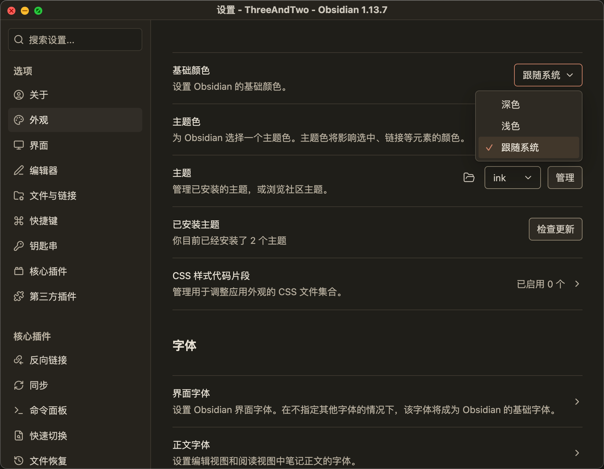

# ink real screenshots / 实机截图

[English README](../README.md) · [中文说明](../README.zh-CN.md)

Only original user-provided screenshots of the actual Obsidian application are included here. The generated design mockups previously placed in the gallery have been removed from the repository and the README.

这里只展示作者提供的真实 Obsidian 原始截图。之前加入图册的生成设计图已从仓库和 README 移除。

## Dark settings and dropdown / 深色设置与下拉

Source: the author's newly supplied screenshot. The window title shows **Obsidian 1.13.7**, the selected theme is **ink**, and the appearance dropdown is open. The installed theme's exact version is not visible. This file is copied unchanged from the supplied image, without reconstruction or image generation.

来源：作者刚提供的实机截图。窗口标题可见 **Obsidian 1.13.7**，已选主题为 **ink**，外观下拉列表展开。截图没有显示主题文件的具体版本。图片按原始文件保存。

## Earlier dark English reading / 早期深色英文阅读

Source: the author's earlier reading screenshot, captured before the 1.3.8 inline-code change. The image shows actual reading content and the dotted background. Neither the exact Obsidian version nor the installed theme version was confirmed for this earlier capture. It is not labeled as a current-release acceptance screenshot.

来源：作者之前提供的阅读实机图，早于 1.3.8 的行内代码修改。保留其实际正文与点阵表现；该图的 Obsidian 和主题具体版本均未确认，不作为最新版验收截图。

## Scenes awaiting real captures / 待拍场景

Light-mode reading and settings, Markdown emphasis, editing, Todo, tables, diagrams, Canvas, drawing, Bases, search, narrow panes and mobile layouts still need real screenshots. These sections will stay unillustrated until captures from the application are available.

浅色阅读与设置、Markdown 强调、编辑、Todo、表格、图形、Canvas、绘图、Bases、搜索、窄分栏及移动端，待真实拍摄后补充。

Use the bundled sample notes for captures. Record Obsidian/theme versions and relevant plugins; retain the actual output. A layout sketch or generated mockup is not a product screenshot.

截图使用仓库样例笔记，注明 Obsidian/主题版本及相关插件，并保留真实输出。

Original source filenames, dimensions and SHA-256 are recorded in [gallery-assets.json](gallery-assets.json). This records file provenance and integrity; it does not independently verify the installed application or theme files.
