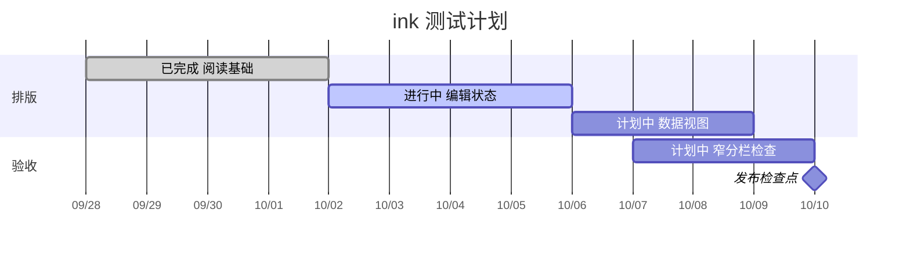

---
tags:
- ink-test
cssclasses:
- paper-data
---
# Roadmap

这是 2026 年 10 月的测试计划，不是真实承诺日期。

| 阶段 | 状态 | 起点 | 终点 |
| --- | --- | --- | --- |
| 阅读基础 | 已完成 | 2026-09-28 | 2026-10-02 |
| 编辑状态 | 进行中 | 2026-10-02 | 2026-10-06 |
| 数据视图 | 计划中 | 2026-10-06 | 2026-10-09 |
| 窄分栏检查 | 计划中 | 2026-10-07 | 2026-10-10 |

- [x] 阅读基础
- [ ] 编辑状态
- [ ] 数据视图
- [ ] 窄分栏检查

## 检查点

- 已完成、进行中、计划中同时有文字和不同状态色。
- 日期标签、中文图形标题清晰，窄分栏能局部滚动。
- today 标记按实际日期绘制；测试计划日期之外可能看不到该标记。
