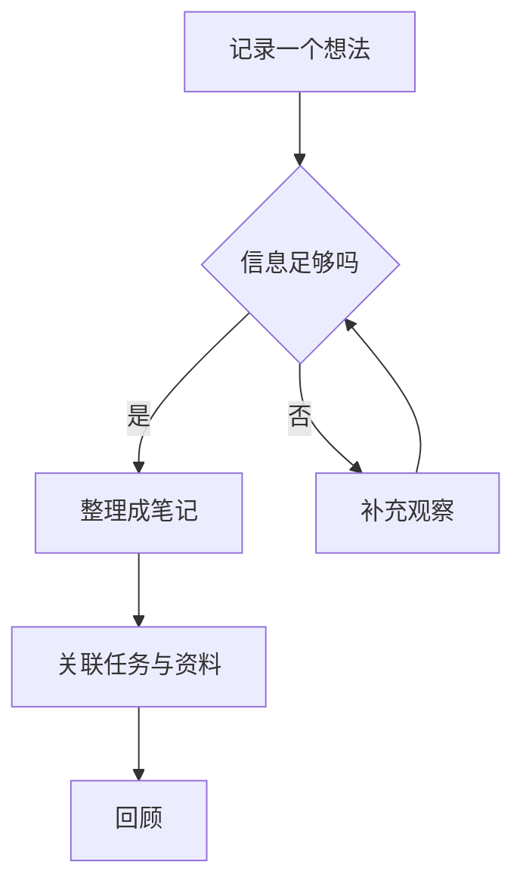
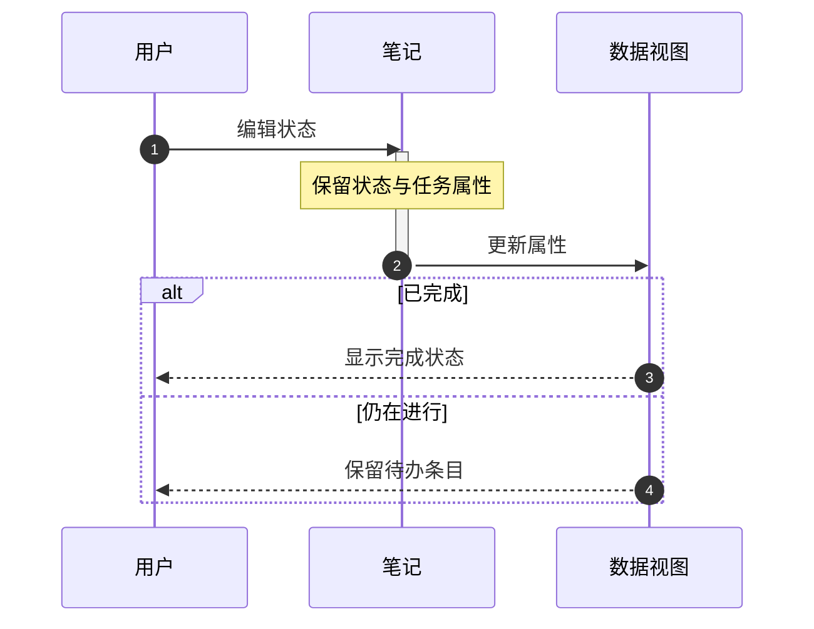
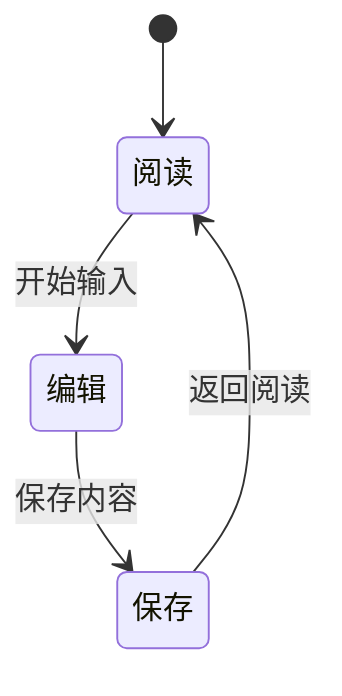
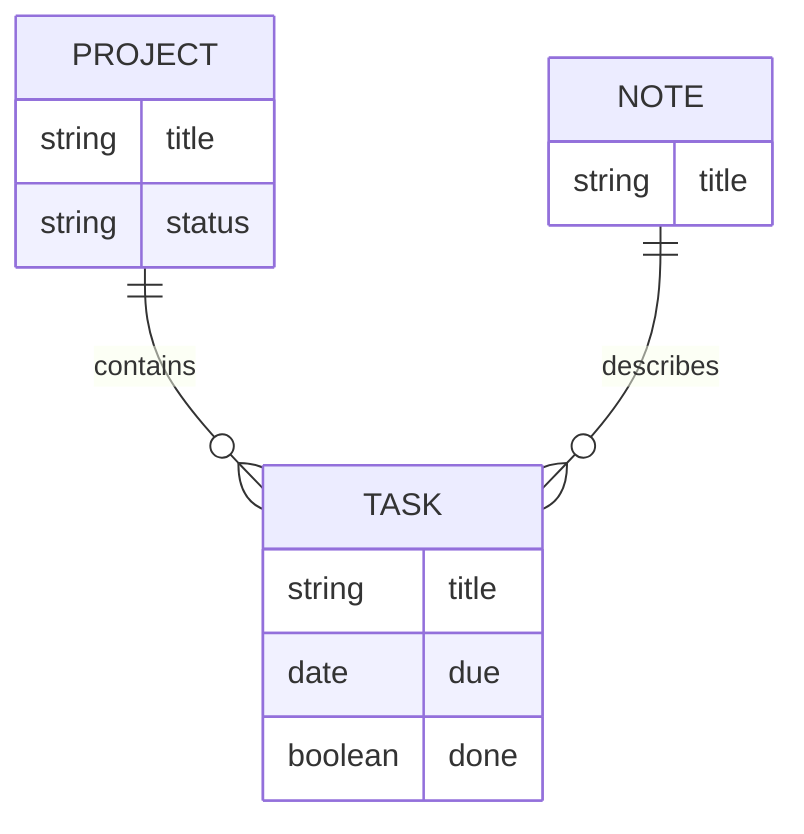

---
tags:
- ink-test
cssclasses:
- paper-data
---
# 流程、时序、状态与关系图

## 流程图

## 时序图

## 状态图

## 数据关系示意

## 检查点

- 节点、连线、箭头和分支标签清楚；循环没有被裁掉。
- 普通字体显示中文，聚焦示例节点有赭红边界。
- 深色下三个角色、注释、alt 首个条件和 else 条件均可读，没有黑字落在深色框上。
- 激活条不是刺眼的白条；四个序列编号的文字与徽章底色有足够反差。
- 状态转换标签使用纸面背景，文字清楚；ER 圈形基数符号保持空心。
- 阅读、实时预览以及笔记的悬浮预览中都检查同一个图形。
- `ink-focus` 只需 class 声明，由主题控制浅色/深色表面；不用写死浅色 classDef。
- ER 图是关系示意，实际可编辑数据库请打开 [[ink-17 数据库Bases]]。
