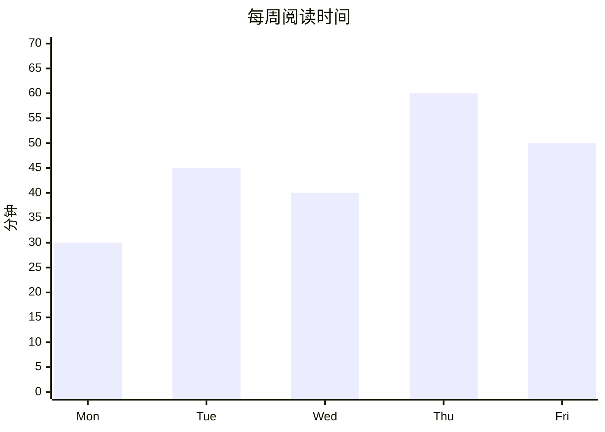
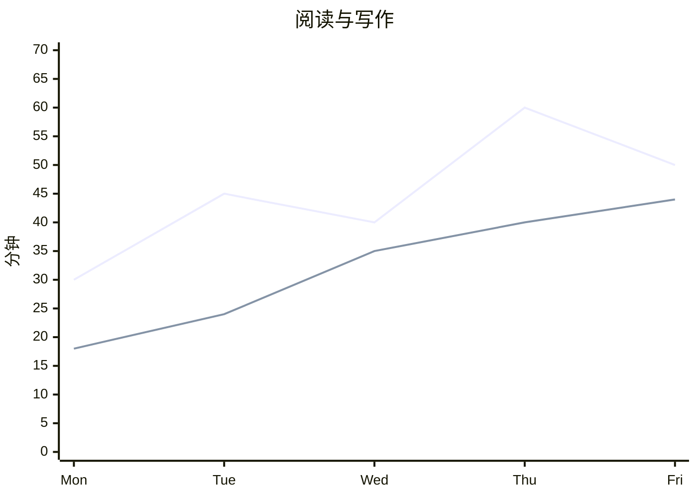
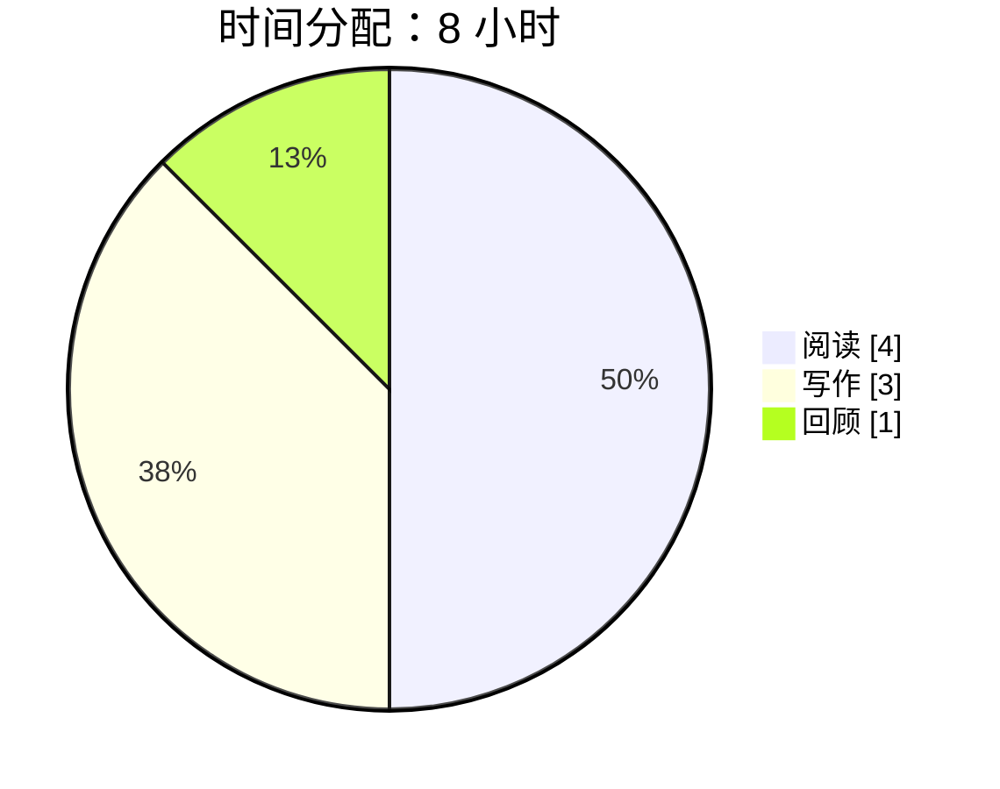

---
tags:
- ink-test
cssclasses:
- paper-data
---
# 柱状图、折线图与饼图

以下数值均为测试数据。

## 柱状图

## 两个系列的折线图

第一系列为阅读，第二系列为写作。第二条线使用灰蓝虚线；配合数据表识别，避免只靠颜色。

| 系列 | Mon | Tue | Wed | Thu | Fri |
| --- | ---: | ---: | ---: | ---: | ---: |
| 阅读（第一条） | 30 | 45 | 40 | 60 | 50 |
| 写作（第二条） | 18 | 24 | 35 | 40 | 44 |

## 饼图

| 项目 | 小时 | 占比 |
| --- | ---: | ---: |
| 阅读 | 4 | 50% |
| 写作 | 3 | 37.5% |
| 回顾 | 1 | 12.5% |

## 检查点

- 坐标轴、标题、图例和数据清楚；饼图图例与切片对应。
- 窄分栏和深色下仍可读，没有整块错误反色。
- 深色下绘图区与纸面同色，坐标轴、刻度、标题可读；浅色下恢复浅纸面。
- 甘特与饼图同时切换测试：色块内文字、色块外文字采用不同的对比配色。
- 本机随附 Mermaid 11.13 不具备新版 XY 命名图例能力，所以这里提供明确数据表。
