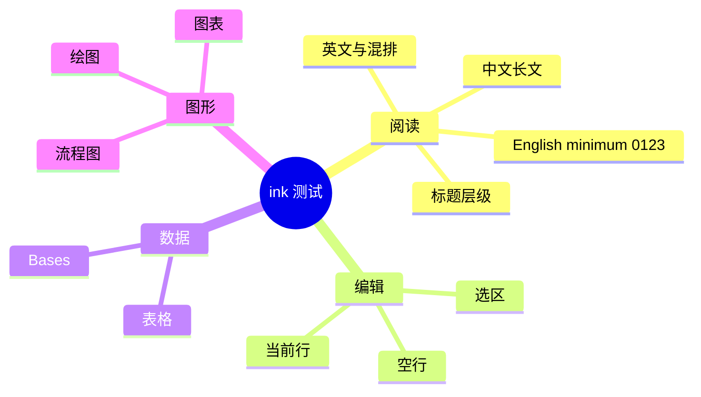

---
tags:
- ink-test
cssclasses:
- paper-data
---
# Mermaid 思维导图

## 同一结构的文字列表

- 阅读：[[ink-01 中文长文]]、[[ink-02 英文与混排]]
- 编辑：[[ink-04 编辑与当前行]]
- 数据：[[ink-07 表格与宽表]]、[[ink-17 数据库Bases]]
- 图形：[[ink-12 流程与时序图]]、[[ink-16 绘图与附件]]

## 检查点

- 节点内的中文、English minimum 0123 和 Bases 使用正常系统字体；浅/深色都能辨认字形。
- 深色下没有荧光填色或浅字浅底；分支采用赭红、灰蓝等低饱和色和淡色节点表面。
- 路径背景与底线随分支色变化，文字始终使用正文墨色。
- Mermaid 思维导图是由代码渲染的；可拖动白板在 [[ink-15 Canvas白板]]。
- 拖动、缩放功能属于原生 Canvas，不把静态 SVG 说成可编辑白板。
